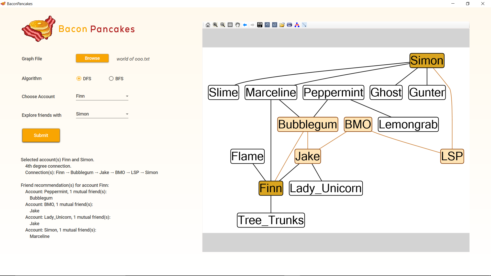

# Tugas Besar 2 Strategi Algoritma

## Algoritma
Program mengimplementasikan 2 strategi algoritma, yaitu strategi BFS dan DFS.
<br>
* BFS, atau *Breadth First Search*, di mana pencarian dimulai dari titik awal, kemudian dilanjutkan ke semua cabang titik tersebut secara terurut. Jika titik tujuan belum ditemukan, maka perhitungan akan diulang kembali ke masing-masing titik cabang dari masing-masing titik, sampai titik tujuan tersebut ditemukan.
* DFS, atau *Depth First Search*, pencarian dilakukan pada satu node dalam setiap level dari yang paling kiri dan dilanjutkan pada node sebelah kanan. Jika solusi ditemukan, tidak diperlukan proses backtracking yaitu penelusuran balik untuk mendapatkan jalur yang diinginkan.

## Requirements
[Visual Studio 2019 (ke atas)](https://visualstudio.microsoft.com/downloads/)
atau
[.NET 5.0](https://dotnet.microsoft.com/download)

Untuk pengalaman yang maksimal, gunakan aplikasi pada layar monitor beresolusi 1920 x 1080 dan layout maksimal 125%.

## Cara Menggunakan Program
*Jika langsung menggunakan executable*
1. Buka aplikasi `BaconPancakes.exe` di dalam folder `bin`

*Jika tidak langsung menggunakan executable*
1. *Clone repository* ini 
```sh
git clone https://github.com/jerwansyah/Tubes2_19116.git
```
2. Masuk ke dalam `Tubes2_19116/src`

*Jika menggunakan Visual Studio*

3. Buka *file* BaconPancakes.sln
4. Tekan tombol *play* pada Visual Studio, yang berada di atas bagian tengah

*Jika tidak menggunakan Visual Studio*

3. Jalankan program dengan menggunakan terminal dengan _command_ di bawah ini
```sh
dotnet run
```

*Setelah GUI sudah terlihat*
1. Pilih file yang ingin digunakan dengan menekan tombol `Browse` dalam aplikasi
2. Pilih algoritma _searching_
3. Pilih akun sumber dan akun tujuan atau hanya akun sumber saja jika hanya ingin mencari rekomendasi teman
4. Klik tombol `Submit`. Et voila!

## Tangkap Layar Aplikasi


## Author
### Kelompok 16 | Bacon Pancakes
| NIM      | Nama                  |
|----------|-----------------------|
| 13519116 | Jeane Mikha Erwansyah |
| 13519118 | Cynthia Rusadi        |
| 13519188 | Jeremia Axel          |
